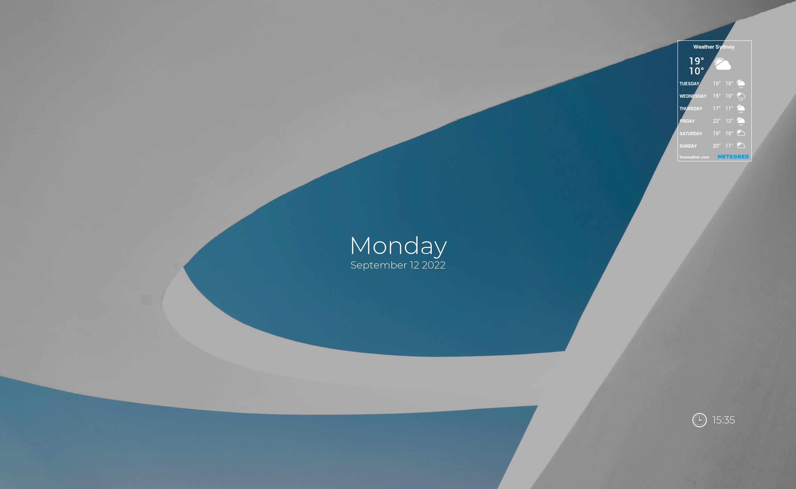

# WallPaperChanger 🖼️

    

# Description ⛈️
This Python script changes your desktop wallpaper based on the weather.
  
# Cloning 🌀

`$ git clone https://github.com/yangman946/WallPaperChanger`

# Running ⚡
You need:
<ul>
  <li>install requirements: <code>pip install -r requirements.txt</code> </li>
  <li>Image url for weather widget: customise your own widget here: https://www.theweather.com/</li>
  <li>Your own api key for openweather: https://openweathermap.org/api </li>
</ul>

 

refer to `mainScript.py` for where to insert these values. 

 

You can run this script two ways:

<ul>
  <li>Via the <code>run.bat</code> script</li>
    <ul>
        <li>Change the first line CD {your file location} to the file location of <code>run.bat</code> </li>
        <li>and use Windows Task scheduler to periodically run the <code>run.bat</code> file. You could make the script run once every hour. </li>
        <li>Or import the provided .xml file into task scheduler (change path to your batch file)</li>
    </ul>
  <li>or Via the command line
    <ul>
      <li>CD to your directory</li>
      <li>run <code>python -m wallpaperChanger.mainScript</code> </li>
    </ul>
  </li>
</ul>

# Customising Wallpapers ✏️

Currently, the `mainScript.py` script supports the following weather states:
<ul>
  <li>Clear </li>
  <li>Mist (cloudy)</li>
  <li>Rain </li>
  <li>and thunder </li>
</ul>

 
You will find separate pairs of folders for each weather condition (day and night). 
These folders contain jpeg images (3936x2624 pixels) each labeled from 1 to the number of images in the folder. 
If you wish to replace images, ensure that:
 
<ul>
  <li>The images are of correct size (recommended 3936x2624 pixels)</li>
  <li>The images are in the correct folders</li>
  <li>The images are properly labelled {weather state}_{day state}_{image index} </li>
  <li>The images are jpeg images </li>
</ul>

# Contributing 👍

If you wish to contribute to this project, send a pull request, and I will look at it. Here’s an easy and quick [video guide](https://youtu.be/waEb2c9NDL8) for learning how to contribute via GitHub.

# TODO List ✔️

This project is a work in progress and will expect frequent updates.
 
<ul>
  <li>Expand wallpaper folders.</li>
  <li><s>Add a sunrise/sunset API to change the daystate. </s></li>
  <li>Add temperature conditions and assign certain wallpapers to temperature. </li>
  <li><s>Make the program run without appearing (invisible)</s></li>
</ul>

 

# Possible improvements ✅
 
<ul>
  <li>Find a wallpaper API, reduces need for having folders full of images</li>
  <li>Show news or other information along with the weather.</li>
  <li>Export as an executable</li>
  <li><s>Make this project compatible with non-windows systems.</s></li>
</ul>
